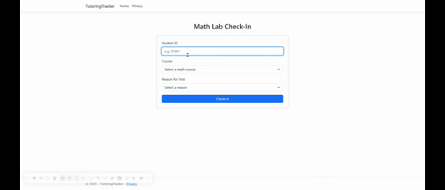

-lightblue?logo=microsoftazure&style=for-the-badge)


# 📊 Math Lab Tutoring Tracker

**Summary**  
A full-stack **.NET 8 web app** for managing **math tutoring lab check-ins and visit analytics**.  
Students submit check-ins, while staff access a secure **Admin Dashboard** to view data, export reports, and measure impact.

🌐 **Live Demo**

[](https://tutoringtracker-eddie-lab.azurewebsites.net/CheckIn)
[](https://tutoringtracker-eddie-lab.azurewebsites.net/AdminLogin)

**Admin Access Code:** `MathLab2025`  
*(Demo credentials for interviewer access — cookie expires automatically after login.)*  
**Student ID's:** `S1001` `S1002` `S1003`

> Hosted on **Azure App Service (Free Tier)** – initial load may take a few seconds due to cold start.

---

🎥 **Demo Preview**



*(Shows student check-in and admin dashboard live on Azure)*

---

## ⚙️ Tech Stack

**Frontend:** ASP.NET Core Razor Pages • Bootstrap UI  
**Backend:** .NET 8 • C# • Entity Framework Core  
**Database:** SQLite (local dev) → Azure-ready  
**Hosting:** Azure App Service (Linux, Free Tier)  
**Tooling:** Azure CLI • Kudu • VS Code • GitHub  

---

## 🎯 1️⃣ Context

College tutoring labs need quick, reliable data capture for:
- Student attendance & course tracking  
- Evidence of support for accreditation/funding  
- Reduced paper or spreadsheet errors  

This project replaces manual systems with a simple, web-based form + analytics dashboard.

---

## 🧩 2️⃣ Implementation

- **Architecture:** Razor Pages + EF Core (code-first).  
- **Models:** `Student`, `Course`, `Visit` linked via `AppDbContext`.  
- **Admin Security:** Cookie-based login protecting dashboard + CSV export.  
- **Deployment:** Published via Azure CLI; runtime adjusted to `.NET 8` after initial PHP container issue.  
- **Troubleshooting:** Used Azure **Log Streaming** + **Kudu Bash** to inspect container behavior and confirm DLL deployment paths.

**OOP Concepts:**  
Encapsulation through models, separation of concerns, and clean page model structure for each feature.

---

## 🚀 3️⃣ Impact

- Demonstrates **end-to-end full-stack ownership** — backend, frontend, database, and deployment.  
- Real-world fit for **higher-ed data tracking** and **student success analytics**.  
- Shows applied skills in **refactoring**, **logging**, and **platform diagnostics**.  
- Deployed, functional demo on Azure App Service (Free Tier).

---

## 🧠 Next Steps

- Add course filters + visual analytics to admin dashboard  
- Integrate campus SSO (OpenID Connect)  
- Scale from Free Tier → **Basic/Standard App Service Plan** to enable autoscaling and multi-instance redundancy.  
- Add **Azure Front Door** or **Traffic Manager** for high availability across regions.  
- Implement **Network Security Groups**, **Azure Firewall**, and **Managed Identity** for defense-in-depth.  
- Apply **RBAC** and **Private Endpoints** for secure service-to-service communication.  
- Migrate to **Azure SQL Database** for resilient, scalable data storage.

---

## 💻 Run Locally

```bash
dotnet restore
dotnet build
dotnet run
